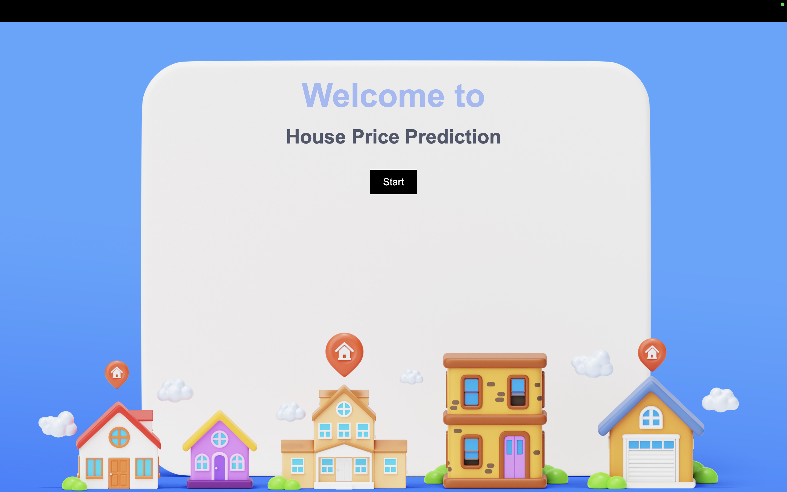
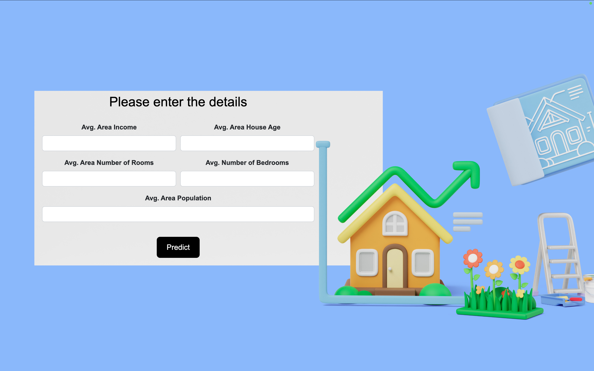

# 🏠 House Price Prediction Web App

This is a machine learning-powered web application built with **Django** that predicts house prices based on input features using a **Linear Regression model** trained on the `USA_Housing.csv` dataset.

## 🖼️ Project Screenshot




## 🚀 **Features**

- Predict house prices using:
  - Average Area Income
  - Average Area House Age
  - Average Area Number of Rooms
  - Average Area Number of Bedrooms
  - Area Population
- Interactive UI built with HTML/CSS and Bootstrap.
- Background animations and image transitions.
- Integrated with scikit-learn for real-time ML predictions.

## 🛠️ **Tech Stack**

- **Backend:** Python, Django, scikit-learn, pandas, numpy
- **Frontend:** HTML, CSS, Bootstrap
- **Visualization & ML:** matplotlib, seaborn
- **Model:** Linear Regression

## 📁 **Dataset**

- Dataset: [`USA_Housing.csv`](https://www.kaggle.com/datasets/serchox/usa-housing)
- Features:
  - `Avg. Area Income`
  - `Avg. Area House Age`
  - `Avg. Area Number of Rooms`
  - `Avg. Area Number of Bedrooms`
  - `Area Population`
  - `Price` (Target)

 
## ⚙️ **Setup Instructions**

1. **Clone the repository**
   ```bash
   git clone https://github.com/animesh/house-price-prediction.git
   cd house-price-prediction
